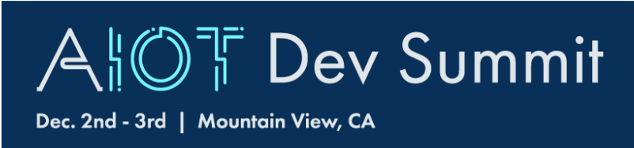

# TinyML Application Development for Everyone

## Hands-on workshop at Arm AIoT Dev Summit December 2019

In this tutorial we will teach a board to recognise gestures! We'll capture motion data from the [Arduino Nano 33 BLE Sense](https://store.arduino.cc/arduino-nano-33-ble-sense) board, import it into TensorFlow to train a model, and deploy a classifier onto the board using [TensorFlow Lite for microcontrollers](https://www.tensorflow.org/lite/microcontrollers/overview). 

## Exercises

* [Introduction](exercises/intro.md)
* [Exercise 1: Development Environment](exercises/exercise1.md)
* [Exercise 2: Source Code](exercises/exercise2.md)
* [Exercise 3: Hardware](exercises/exercise3.md)
* [Exercise 4: Visualizing the IMU Data](exercises/exercise4.md)
* [Exercise 5: Gather the Training Data](exercises/exercise5.md)
* [Exercise 6: Machine Learning](exercises/exercise6.md)
* [Exercise 7: Classifying IMU Data](exercises/exercise7.md)
* [Exercise 8: Emojis](exercises/exercise8.md)
* [Exercise 9: Gesture Controlled USB Emoji Keyboard](exercises/exercise9.md)
* [Exercise 10: Next Steps](exercises/exercise10.md)

