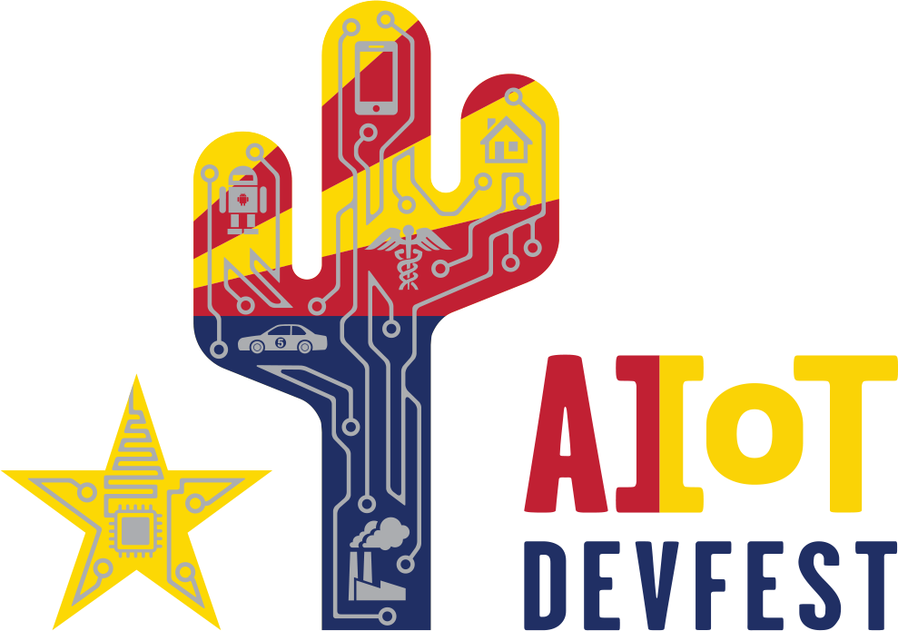
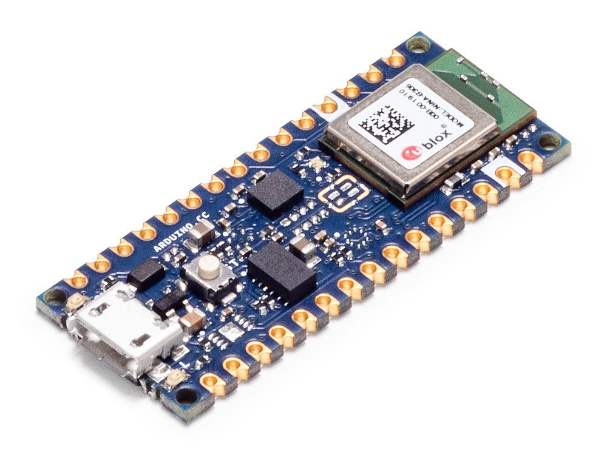

# TinyML Application Development for Everyone

&nbsp;

## Hands-on workshop at AIoT Devfest January 2020

In this workshop we will teach an Arduino board to recognize gestures! We will capture motion data from the [Arduino Nano 33 BLE](https://store.arduino.cc/arduino-nano-33-ble) board[1](#note1), import it into TensorFlow to train a model, and deploy a classifier onto the board using [TensorFlow Lite for microcontrollers](https://www.tensorflow.org/lite/microcontrollers/overview). 

The hardware for this workshop has been provided by [Arduino](https://arduino.cc)

## Exercises

* [Introduction](exercises/intro.md)
* [Exercise 1: Development Environment](exercises/exercise1.md)
* [Exercise 2: Source Code](exercises/exercise2.md)
* [Exercise 3: Hardware](exercises/exercise3.md)
* [Exercise 4: Visualizing the IMU Data](exercises/exercise4.md)
* [Exercise 5: Gather the Training Data](exercises/exercise5.md)
* [Exercise 6: Machine Learning](exercises/exercise6.md)
* [Exercise 7: Classifying IMU Data](exercises/exercise7.md)
* [Exercise 8: Emojis](exercises/exercise8.md)
* [Exercise 9: Gesture Controlled USB Emoji Keyboard](exercises/exercise9.md)
* [Exercise 10: Next Steps](exercises/exercise10.md)

This workshop material was developed by Sandeep Mistry and Don Coleman. 

<a href="https://arduino.cc"><a/>

Previous versions
 * https://github.com/sandeepmistry/aimldevfest-workshop-2019
 * https://github.com/arduino/AIoT-Dev-Summit-2019

<!-- TODO link to SLIDES -->

<a id="note1">1</a>: You can also use the [Arduino Nano 33 BLE Sense](https://store.arduino.cc/arduino-nano-33-ble-sense) for this workshop.
