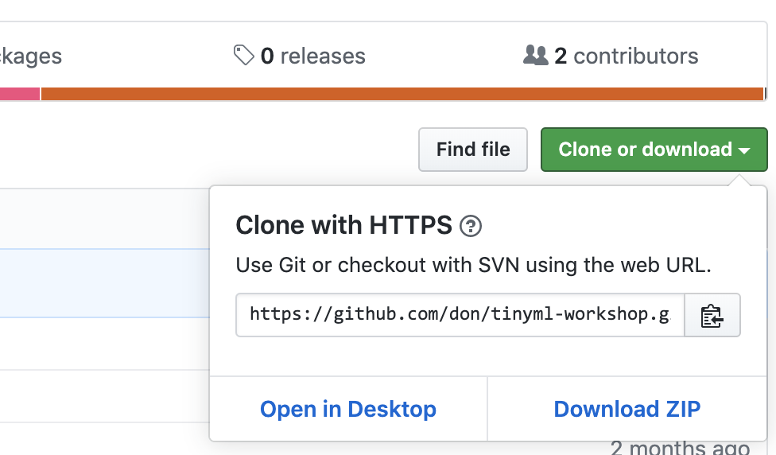

# Exercise 2: Source Code

The [source code](https://github.com/arduino/AIoT-Dev-Summit-2019) for this workshop is available on Github in the Arduino organizaton.

If you're familiar with git and Github, clone the repository to your computer. If that last sentence didn't make sense to you,  we recommend that you download the code.

1. Go to https://github.com/arduino/AIoT-Dev-Summit-2019
1. Click the green **Clone or download** button
1. Choose Download ZIP
1. Go to your downloads folder and extract all the files from the zip archive

Next [Exercise 3: Hardware](exercise3.md)
