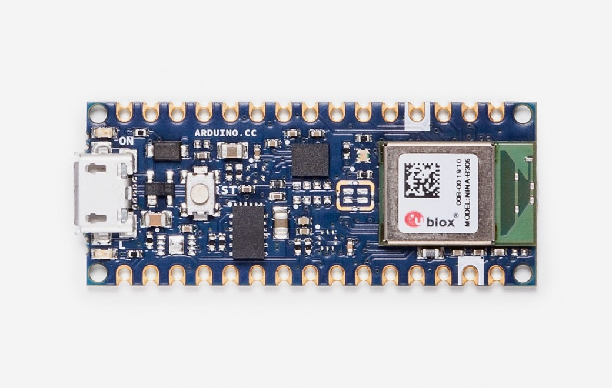

# Exercise 3: Hardware

## Unboxing and set up

1. Remove the Arduino Nano 33 BLE board from the box
1. Plug the micro USB cable into the board and your computer
1. Open the Arduino IDE application on your computer
1. Choose the board `Tools -> Board -> Arduino Nano 33 BLE`
1. Choose the port `Tools -> Port -> COM5 (Arduino Nano 33 BLE)` *Note that the actual port may be different on your computer*

## Hardware Test

1. Plug the micro USB cable into the board and your computer
1. Open `ArduinoSketches/Hardware_Test/Hardware_Test.ino` in the Arduino IDE
1. Choose the board `Tools -> Board -> Arduino Nano 33 BLE`
1. Choose the port `Tools -> Port -> COM5 (Arduino Nano 33 BLE)` *Note that the actual port may be different on your computer*
1. Upload the code to the board `Sketch -> Upload`
1. Both LEDs next to the USB port should be on
1. Open the serial monitor `Tools -> Serial Monitor` to see debug messages
1. If everything is working properly, the LED will start blinking quickly

__NOTE:__ The first time you upload a sketch to the Arduino Nano 33 BLE, the USB port name might change. If this happens, you need to re-select the port using the `Tools -> Port` menu.

Next [Exercise 4: Visualize the IMU Data](exercise4.md)

