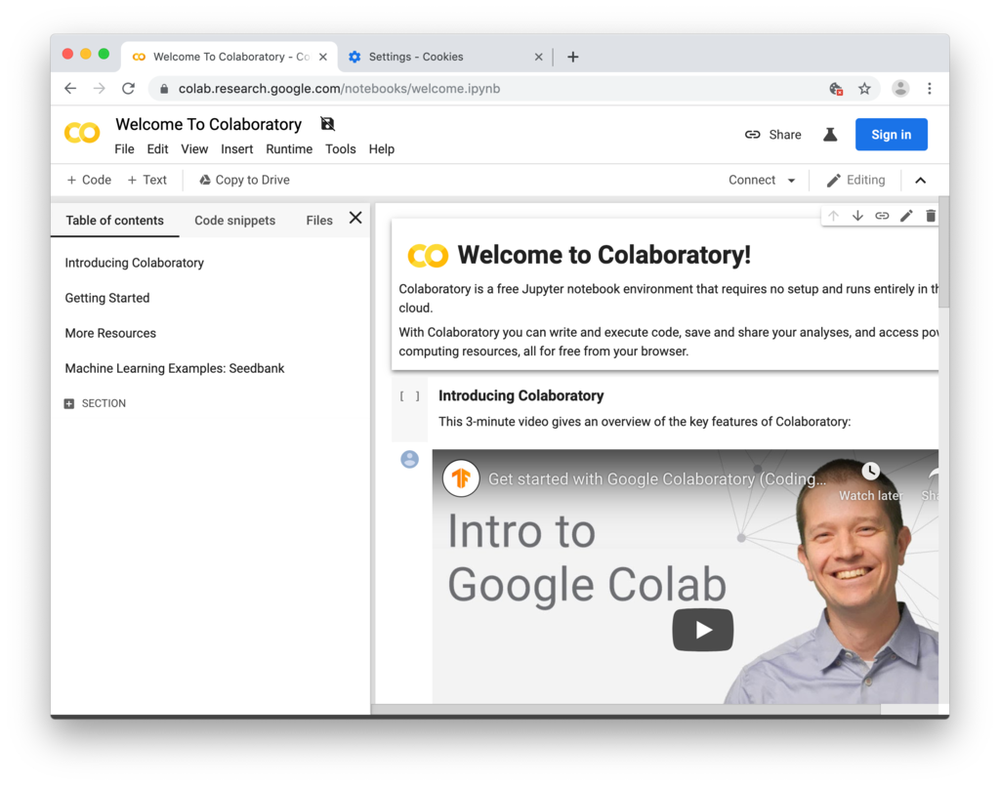
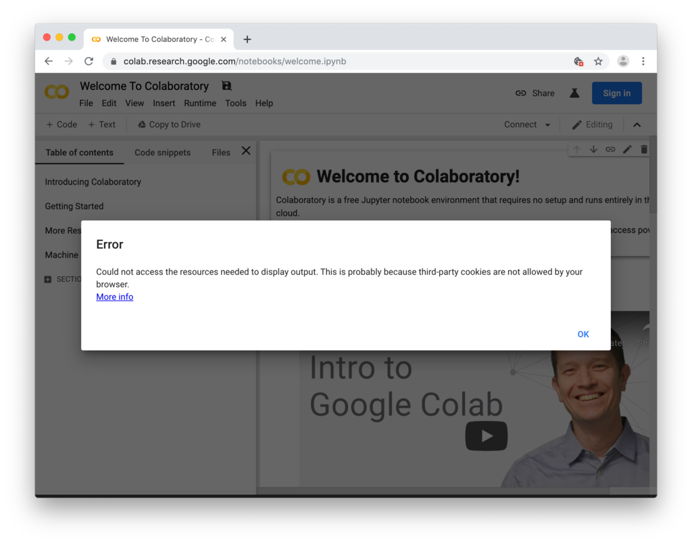
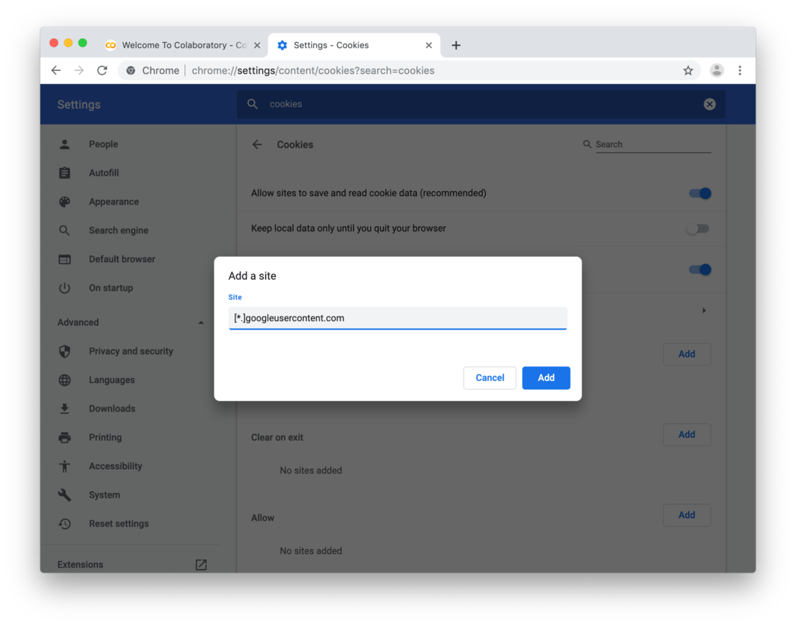

# Exercise 6: Machine Learning

We're going to use [Google Colab](https://colab.research.google.com) to train our machine learning model. Colab provides a Jupyter notebook that allows us to run our machine learning model in a web browser.

## 3rd Party Cookies

Some of you might see an error about 3rd party cookies. 

You can enable 3rd party cookies, or better yet, add an exception for `[*.]googleusercontent.com`.

## Open the Notebook

Open the [arduino_tinyml_workshop.ipynb](../arduino_tinyml_workshop.ipynb) notebook in Google Colab and follow the instructions in the notebook to prepare the data and train the model.

https://colab.research.google.com/github/don/tinyml-workshop/blob/master/arduino_tinyml_workshop.ipynb

Next [Exercise 7: Classifying IMU Data](exercise7.md)
