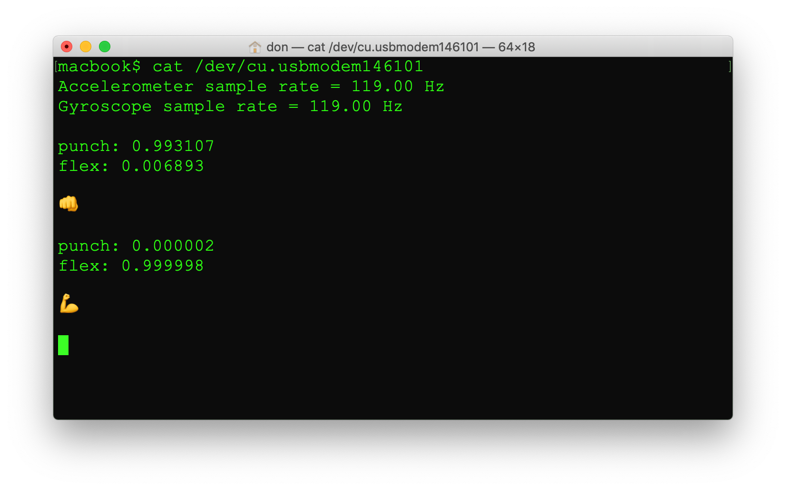
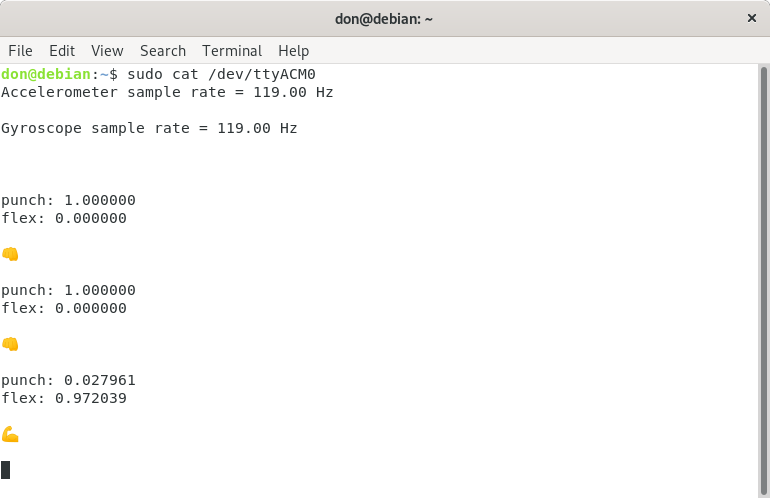
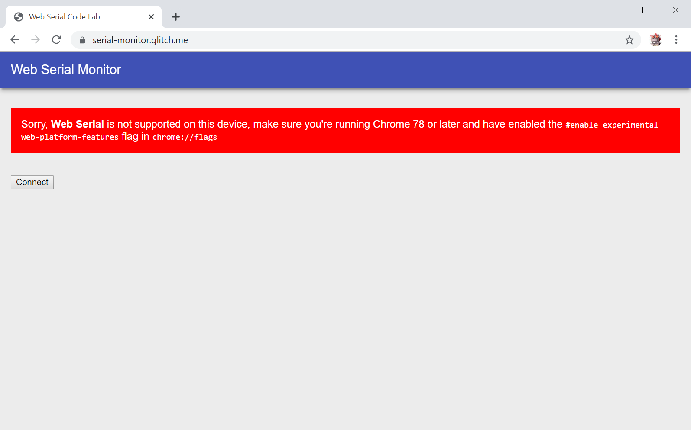
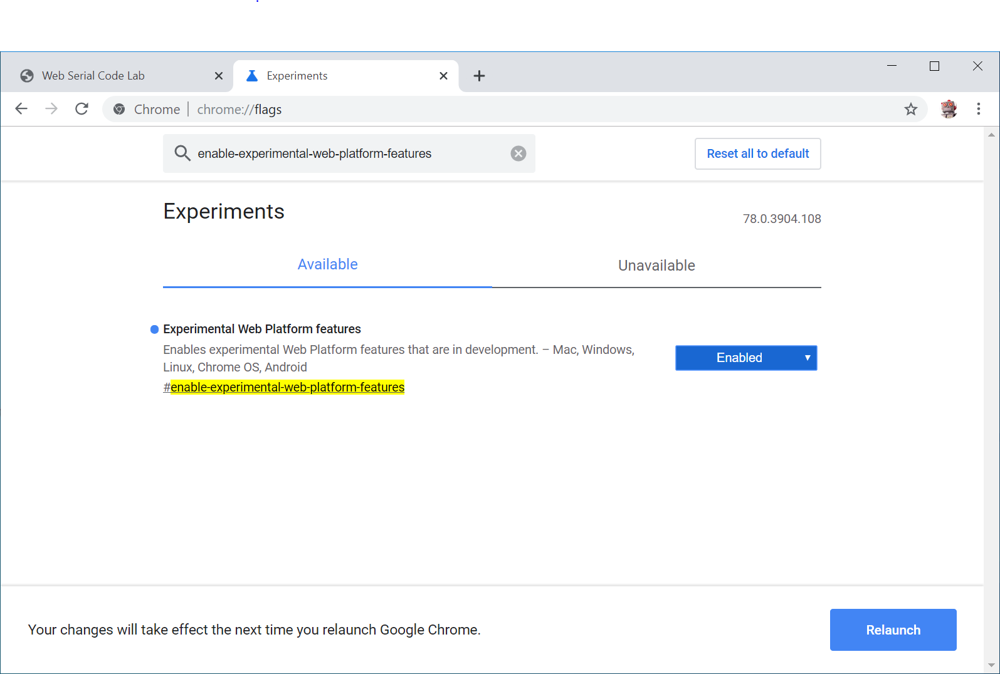
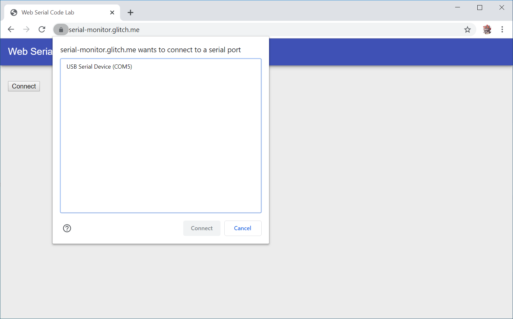
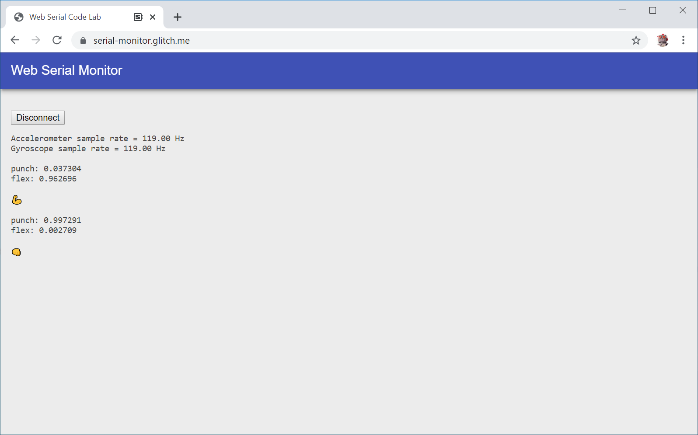

# Exercise 8: Emojis

## Print an emoji

Now that we the code can recognize gestures, let's try printing out some emojis in addition to the text.

Open __AIoT-Dev-Summit-2019/ArduinoSketches/IMU_Classifier/IMU_Classifier.ino__ in the Arduino IDE if it's not already loaded.

Create a new char* array named `EMOJIS`. Inside the array defines the emojis as a UTF-8 encoded unicode strings. This array must be the same length at the `GESTURE` array. The order of the emojis in the array must match the order of the gestures.

    const char* EMOJIS[] = {
        u8"\U0001f44a",   // punch
        u8"\U0001f4aa"    // flex 
    };

If you're recorded additional gestures, you can find the unicode characters on the [Unicode Consortium website](http://www.unicode.org/emoji/charts/full-emoji-list.html).

In the `loop` function, after the gestures and probabilities are printed, add some code to print the emoji for the gesture if the probability is over 80%.

    for (int i = 0; i < NUM_GESTURES; i++) {
        if (tflOutputTensor->data.f[i] > 0.8) {
            Serial.println(EMOJIS[i]);
            Serial.println();
        }
    }

Compile and deploy the updated code onto your Arduino using `Sketch -> Upload`.

The Serial Monitor in the Arduino IDE can't display unicode characters, so we need to use a different tool to view the output. For Linux and MacOS users, we recommend using the terminal. For Windows, you'll need Google Chrome.
 
### MacOS
Open new Terminal by pressing the command key ⌘ and the space bar. Type `Terminal.app` into the Spotlight search window that appers and press enter. Once the terminal opens, type `cat /dev/cu.usb` and hit the TAB key. MacOS should autocomplete the name of the port the Arduino is connected to. This will look something like `/dev/cu.usbmodem146101`. The actual port name will likely be different on your computer. If necessary, get the name of the port from the Arduino IDE.

### Linux

Open a terminal and cat the output from the Arduino device. If necessary, get the name of the port from the Arduino IDE.

### Windows

The Windows terminal won't display emojis. Instead we created a web page that uses the experimental Web Serial API in [Google Chrome](https://google.com/chrome).

Using Google Chrome, open [https://serial-monitor.glitch.me](https://serial-monitor.glitch.me). 

You'll likely need to enable the Web Serial API by toggling the #enable-experimental-web-platform-features flag in chrome://flags.

After enabling the experimental features, click the Relaunch button to restart Chrome. Open https://serial-monitor.glitch.me and click the `Connect` button. Choose the COM port for your Arduino. 

Make a gesture and the results will be displayed in the web page.

Next [Exercise 9: Gesture Controlled USB Emoji Keyboard](exercise9.md)
